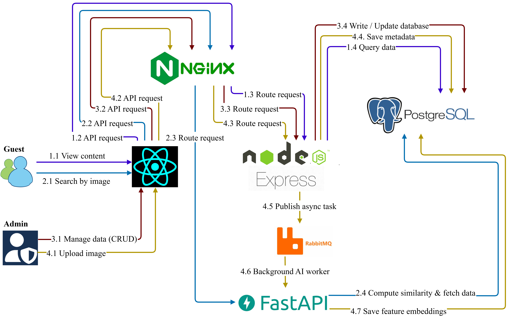
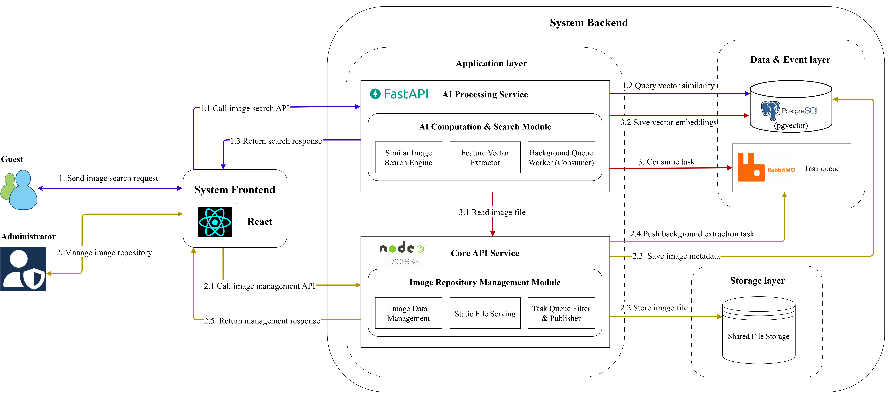
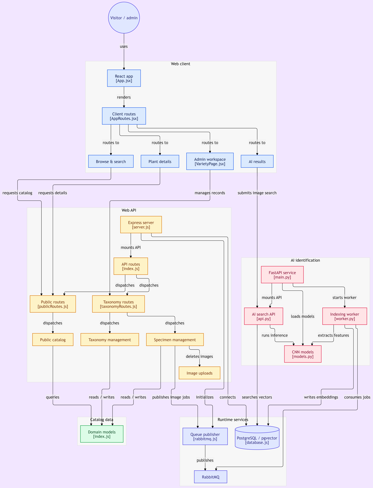

# 🌿 Plant Knowledge & CBIR-Based Identification System

> A microservices-based Content-Based Image Retrieval (CBIR) platform for plant identification and taxonomy management. Uses deep CNNs for feature extraction and PostgreSQL's `pgvector` for similarity search.

---

<!-- TECH STACK BADGES -->
<p align="center">
  
  
  
  
  
  
  
  
  
  
  
  
</p>

---

## 📌 Engineering Highlights

- **Asynchronous Processing:** RabbitMQ decouples write-heavy image uploads from embedding generation, keeping the Node.js API responsive.
- **Resource & Memory Management:** Prevents Out-Of-Memory (OOM) errors on constrained hardware via global model loading, a thread lock (`predict_lock`) for inference serialization, and background worker pausing during live user queries.
- **Vector Similarity Search:** Stores CNN embeddings directly in PostgreSQL using `pgvector` (L2/Cosine distance) for sub-second visual retrieval.
- **Unified Gateway:** Nginx acts as a reverse proxy routing requests to the React frontend, Node.js CRUD API, and FastAPI AI service—eliminating CORS issues.
- **Dockerized Stack:** Fully orchestrated multi-container setup with isolated bridge networking and shared volumes for stored assets.

---

## 🎥 Demonstration

[](https://youtu.be/BmrZc7fP2-Q)

<p align="center">
  <strong>▶ Watch the full end-to-end demonstration</strong>
</p>

---

## 🏛️ System Architecture

### 1. Ingress & Routing

Nginx serves as the single public entrypoint (port 80) and routes internal traffic based on URL paths:
- `/` $\rightarrow$ React SPA
- `/api/ai/*` $\rightarrow$ FastAPI AI Service
- `/api/*` $\rightarrow$ Node.js / Express Core API

<p align="center">
  
  <br />
  <em>Figure 1: Service topology, reverse proxy routing, and data flow.</em>
</p>

---

### 2. Search & Ingestion Flow

- **Live Search (Synchronous):** User submits an image via React $\rightarrow$ FastAPI runs inference through the CNN $\rightarrow$ queries top matching vectors from `pgvector` $\rightarrow$ returns matches immediately.
- **Specimen Ingestion (Asynchronous):** Admin uploads a new plant via Express API $\rightarrow$ image is stored and task is published to RabbitMQ $\rightarrow$ FastAPI worker consumes the queue, extracts features, and writes embeddings to PostgreSQL.

<p align="center">
  
  <br />
  <em>Figure 2: Synchronous query path vs. asynchronous indexing worker.</em>
</p>

---

### 3. Detailed Component & Code-Level Dataflow

> **Automated Source Trace:** Synthesized directly from repository structure via [GitDiagram](https://gitdiagram.com) to map physical file boundaries, ingress routing, and service interaction.

<p align="center">
  
  <br />
  <em>Figure 3: File-level component interaction and dataflow topology (synthesized via GitDiagram).</em>
</p>

#### Architectural Breakdown:
- **Client SPA (`frontend-web`):** `App.jsx` and `AppRoutes.jsx` route public catalog browsing, administrative taxonomy workspaces (`VarietyPage.jsx`), and visual search results.
- **Core API (`backend-web`):** Express gateway (`server.js`) executes relational CRUD operations and dispatches specimen indexing jobs to RabbitMQ (`rabbitmq.js`).
- **AI Service (`backend-AI`):** FastAPI (`main.py`) hosts the live search API (`api.py`) and a background worker (`worker.py`), running inference on pre-loaded CNN weights (`models.py`).
- **Data & Messaging:** PostgreSQL with `pgvector` performs high-dimensional similarity queries, shielded from write bursts by RabbitMQ message queues.

---

### 4. Resource Control & OOM Prevention

To run deep learning inference reliably on limited hardware (CPU or small VRAM instances), the FastAPI service applies three specific controls:

1. **One-Time Model Loading:** The CNN model is loaded into memory once during FastAPI startup (`lifespan` handler) instead of reloading per request.
2. **API Priority Pause:** When an interactive search request arrives, the background RabbitMQ consumer temporarily yields to dedicate CPU/GPU resources to the live query, reducing search latency.
3. **Inference Concurrency Lock (`predict_lock`):** Uses a threading lock to allow only 1 image forward-pass at a time. Incoming requests are queued rather than executed in parallel, capping peak RAM/VRAM usage and preventing memory crashes (OOM).

---

## ⚠️ Prerequisites: Git LFS Required

This repository tracks large binary artifacts, pre-trained CNN weight files, and compressed asset bundles using **Git Large File Storage (Git LFS)**. 

Ensure Git LFS is installed on your local workstation **before** cloning:

```bash
# 1. Install Git LFS
# macOS (Homebrew)
brew install git-lfs

# Ubuntu / Debian
sudo apt-get install git-lfs

# Windows (Chocolatey)
choco install git-lfs

# 2. Initialize Git LFS hooks
git lfs install
```

If you have already cloned the repository without Git LFS, pull the binary model files manually:

```bash
git lfs pull
```

---

## 🚀 Quick Start (Under 5 Minutes)

### 1. Clone the Repository

```bash
git clone https://github.com/KN-16/Plant-Knowledge-System.git
cd Plant-Knowledge-System
```

### 2. Extract Dependencies & Pre-trained CNN Models

```bash
# Extract backend web upload directory dependencies
cd backend-web
unzip uploads.zip -d .
cd ..

# Extract pre-trained CNN weights for the AI inference engine
cd backend-AI
unzip models.zip -d .
cd ..
```

### 3. Spin Up Infrastructure

```bash
# Build and orchestrate all microservices in detached mode
docker compose up -d --build
```

Verify that all service containers are healthy:

```bash
docker compose ps
```

---

## 🌐 Access URLs

Once the containers are running, you can access the services via your browser:

| Service | Protocol / Target | Local URL | Port |
| :--- | :--- | :--- | :--- |
| **Web Client (Client Portal)** | HTTP / React (Vite) | `http://localhost` | `80` (via Nginx) |
| **Admin Dashboard** | HTTP / React SPA | `http://localhost/admin` | `80` (via Nginx) |
| **AI API** | REST / OpenAPI Docs | `http://localhost/api/ai/` | Internal proxy |
| **Core API (Node.js)** | REST / JSON | `http://localhost/api` | Internal proxy |
| **pgAdmin (DB Management)** | Web UI | `http://localhost:5050` | `5050` |
| **RabbitMQ Management** | AMQP Web Dashboard | `http://localhost:15672` | `15672` |

---

## 🔐 System Accounts & Default Credentials

> **Notice:** The values below are pre-seeded via `init.sql` for evaluation and local testing environments.

### Application Credentials
```txt
Admin Role:
  Username: admin (or admin@system.com)
  Password: 123456
  Access:   Full CRUD on taxonomy, morphology, user management, and AI knowledge chunks.

Standard User Role:
  Username: user (or user@example.com)
  Password: 123456
  Access:   Visual plant identification and botanical knowledge browsing.
```

### Infrastructure Accounts
```txt
pgAdmin (Web UI):
  Email:    admin@example.com
  Password: adminpass

RabbitMQ (Message Broker):
  Username: admin
  Password: admin

PostgreSQL (Direct Connection):
  Database: plant_knowledge_db
  User:     admin
  Password: adminpass
```

---

## 📂 Project Structure

```text
plant-knowledge-system/
├── backend-web/              # Node.js REST API (Express, Sequelize, Auth, Task Dispatcher)
├── backend-AI/               # AI Service (FastAPI, PyTorch CNN Inference, Queue Worker)
├── frontend-web/             # Modern React SPA (Vite, Tailwind/Bootstrap, Catalog, UI)
├── nginx-gateway/            # Nginx Reverse Proxy (Ingress Gateway & Unified Routing)
│   └── nginx.conf            # Gateway routing configuration
├── pgadmin/                  # Database management UI configuration
│   └── servers.json          # Preconfigured connections
├── envs/                     # Centralized environment variables per service
├── docs/                     # Media, architectural diagrams, and documentation
│   └── placeholders/         # Architectural flowcharts and demo media
├── init.sql                  # Database schema, pgvector extension, and seed data
├── docker-compose.yml        # Multi-service container orchestration
├── .gitignore
└── README.md
```

---

## ⚙️ Environment Configuration

The system uses centralized environment configuration files located in the `envs/` directory:

```text
envs/
├── .env.productionBackendWeb   # Node.js API, JWT tokens, Express port, DB connection
├── .env.productionBackendAI    # FastAPI settings, PyTorch model paths, Vector dims
├── .env.productionPgadmin      # PgAdmin web UI credential defaults
├── .env.productionPostgres     # PostgreSQL database configuration and passwords
└── .env.productionRabbit       # RabbitMQ broker credentials and virtual host setups
```

---

## ⚠️ Important Notes for Deployment

### ✅ Safe for Local Development
The default values are configured for immediate plug-and-play testing on `localhost`.

### 🔐 Mandatory Changes for Production Deployments
Before deploying publicly, you **must** update:
- **JWT Secrets:** `JWT_ACCESS_SECRET`, `JWT_REFRESH_SECRET`
- **Database Credentials:** `POSTGRES_PASSWORD`, `DB_PASS`
- **RabbitMQ Credentials:** `RABBITMQ_DEFAULT_USER`, `RABBITMQ_DEFAULT_PASS`
- **pgAdmin Credentials:** `PGADMIN_DEFAULT_EMAIL`, `PGADMIN_DEFAULT_PASSWORD`
- **TLS/SSL:** Add Let's Encrypt certificates to `nginx-gateway/nginx.conf` (Port `443`).

---

## 🗄️ Database Backup & Restore

### 📤 Dump Database (Export)

```bash
# Dump the database from inside the container to a temporary file
docker compose exec postgres pg_dump -U admin -d plant_knowledge_db --clean --if-exists --encoding=UTF8 -f /tmp/init.sql

# Copy the dump file from the container to the host machine
docker compose cp postgres:/tmp/init.sql ./init.sql
```

---

### 📥 Restore Database (Import)

#### Option 1: File Copy into Container (Recommended)

```bash
docker compose cp ./init.sql postgres:/tmp/init.sql
docker compose exec postgres psql -U admin -d plant_knowledge_db -f /tmp/init.sql
```

#### Option 2: Direct Pipe (No file copy needed)

```bash
cat init.sql | docker compose exec -T postgres psql -U admin -d plant_knowledge_db
```

---

## 📝 Notes & Troubleshooting

- **`pgvector` Extension:** PostgreSQL requires vector extension support. The `init.sql` script initializes `CREATE EXTENSION IF NOT EXISTS vector;` automatically.
- **Model Files:** Ensure `models.zip` is unzipped into `backend-AI/` so that model weight paths resolve correctly upon startup.
- **Upload Directory:** Ensure `uploads.zip` is extracted into `backend-web/` to prevent missing file exceptions during media serving.
- **Data Persistence:** Database files are persisted via named Docker volumes. To wipe data completely and re-seed, run `docker compose down -v`.
- **Port Availability:** Ensure ports `80`, `5050`, and `15672` are free on the host machine prior to running `docker compose up`.
